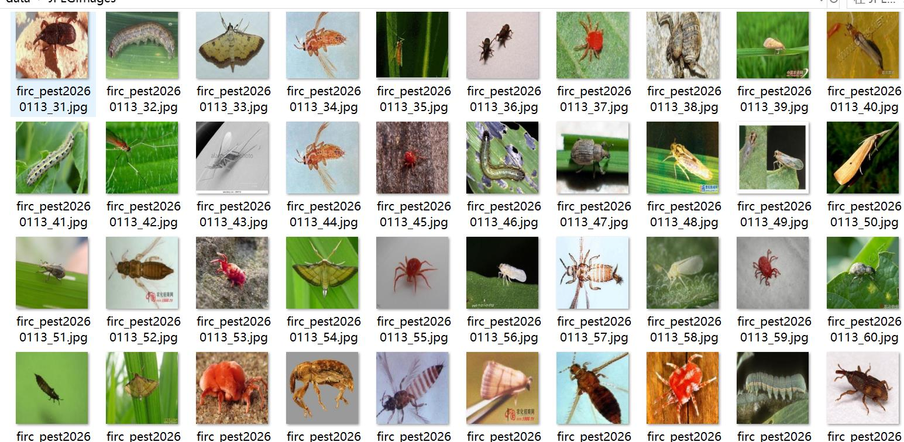
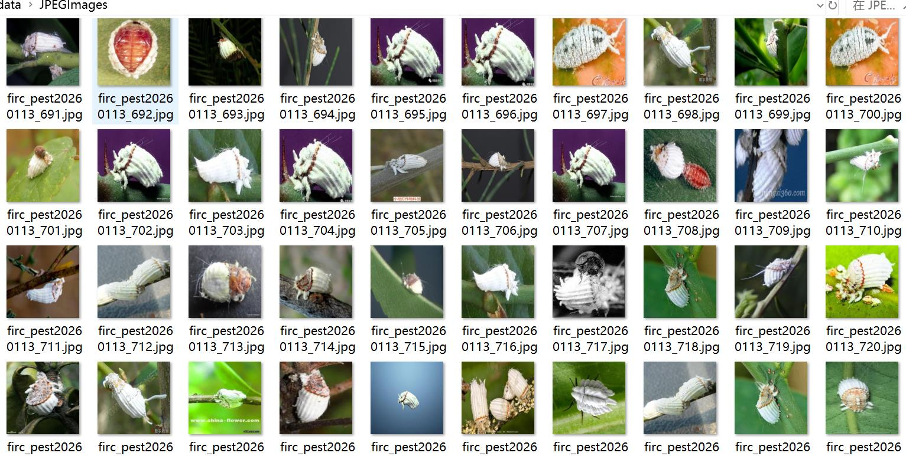
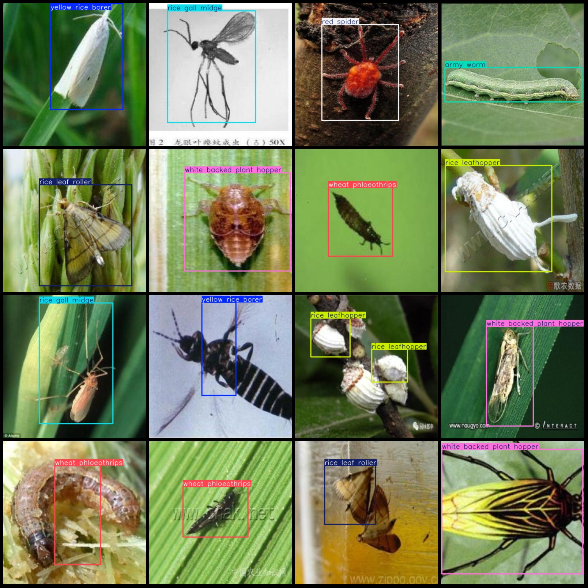
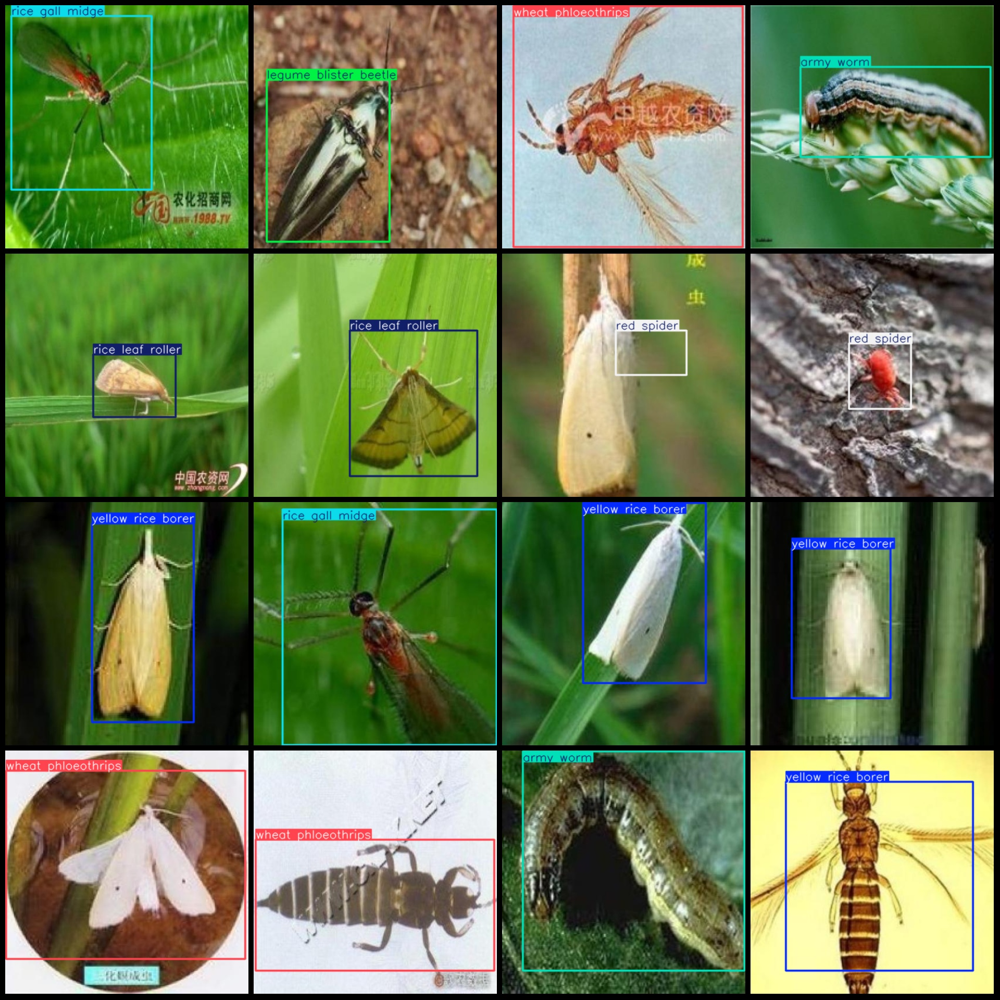

# Rice and Wheat Pests and Disease Detection Dataset VOC+YOLO Format with 1003 Images in 10 Categories

Dataset format: Pascal VOC format + YOLO format (without split path in the txt file, only including jpg images as well as corresponding VOC format xml files and YOLO format txt files).
Number of images (jpg file counts): 1003
Number of annotations (xml file counts): 1003
Number of annotations (txt file counts): 1003
Number of annotation categories: 10
Annotation category names (note that the order of labels in YOLO format is not consistent with this, but is based on the labels folder "classes.txt"): ["army worm", "legume blister beetle", "red spider", "rice gall midge", "rice leaf roller", "rice leafhopper", "rice water weevil", "wheat phloeothrips", "white backed plant hopper", "yellow rice borer"]
Number of bounding boxes per category:
army worm (silkworm/maddison) = 102
legume blister beetle (bean weevil) = 99
red spider (red mite) = 100
rice gall midge (rice galled bug) = 98
rice leaf roller (rice leaf roller) = 102
rice leafhopper (rice leafhopper) = 110
rice water weevil (rice water weevil) = 104
wheat phloeothrips (wheat stem grub) = 102
white backed plant hopper (white-backed planthopper) = 100
yellow rice borer (yellow rice borer) = 102
Total bounding box count: 1019
Image resolution: 416x416
Annotation tool used: labelImg
Annotation rule: draw bounding boxes for categories
Important note: No specific statement has been made here
Special declaration: This dataset does not guarantee any accuracy to trained models or weights files
Image preview:

## Images

Here is a pay link on Stripe ( https://buy.stripe.com/3cs8yP7sY87d0vu9AB ). Please contact me lonlonago@foxmail.com after funding $89, and I will send you a complete data files , thank you!

